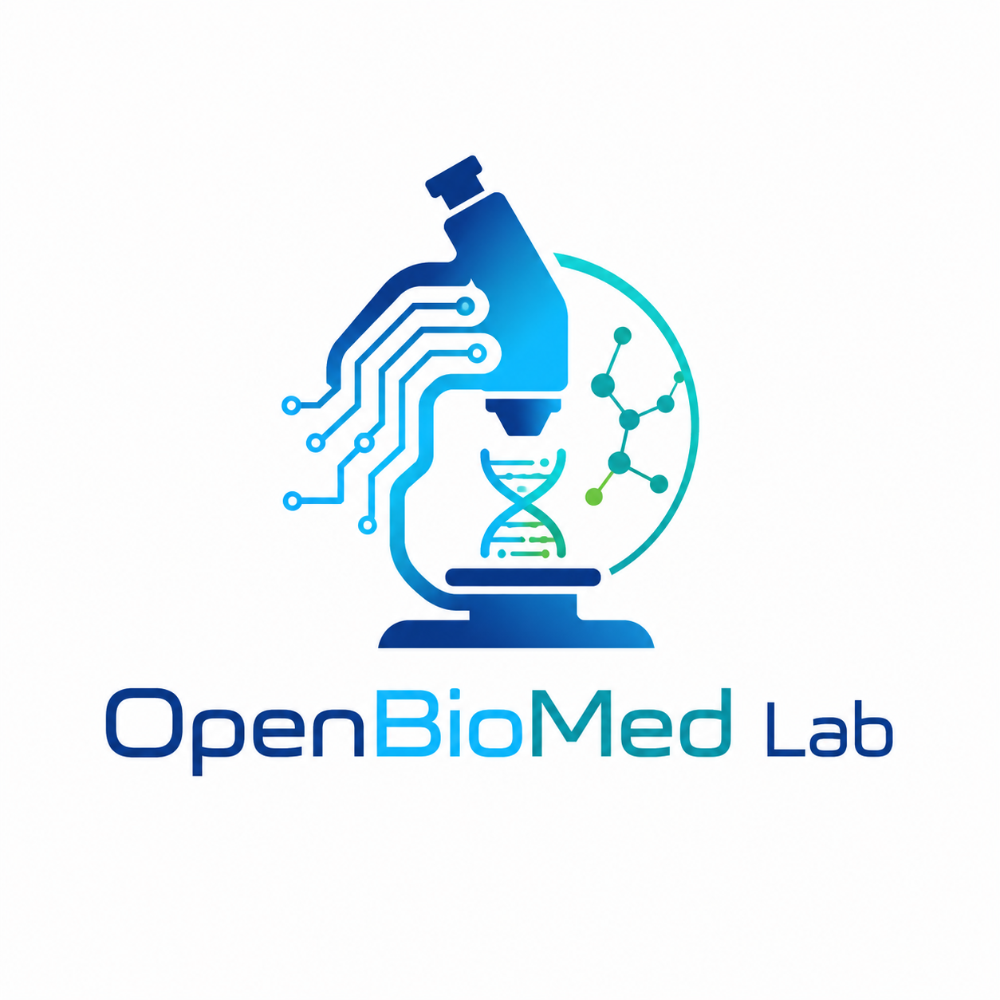

<p align="center">
  
</p>

# OpenBioMed Lab

> 推动 AI Agent 在生物学和医学中的应用进展。
>
> 每一个子项目都是可以独立运行的工具。

[](literature-learning-suite/LICENSE)

---

## 这是什么

OpenBioMed Lab 收集在生物医学 AI 研究中开发的可复现工具。所有工具
都以 AI Agent 作为主要操作界面——不只是给人看的文档，更是给 Agent
直接执行的指令。

---

## 推荐运行环境

本 Lab 的工具都是 **Agent 原生**的——每个子项目包含 `SKILL.md`，
Agent 加载后即掌握完整操作流程。

**经过验证的运行方式：**

- 🤖 **Agent 宿主**：[Hermes Agent](https://github.com/NousResearch/hermes-agent)（[文档](https://hermes-agent.nousresearch.com/docs)）
- 🧠 **语言模型**：[DeepSeek V4 Pro](https://www.deepseek.com/)（[API](https://platform.deepseek.com/)）

这套组合在文献深度分析任务上跑过数百篇论文的验证，稳定可用。

---

## 子项目

### 1. Literature Learning Suite `v1.3.0`

学术文献的深度分析与知识图谱构建工具。

📖 [项目文档](literature-learning-suite/README.md) | [中文指南](literature-learning-suite/GUIDE_ZH.md)

**做什么：** 从 PubMed/arXiv 检索论文 → 全文获取 → 7 层结构化解剖 →
NDJSON 知识图谱持久化 → 自动关联边生成 → 每日速报。

**Agent 一键安装：**

```bash
# 在 Hermes Agent 中执行
git clone https://github.com/YuQingqiu2001/OpenBioMed-Lab.git
cp -r OpenBioMed-Lab/literature-learning-suite ~/.hermes/skills/
```

安装后 Agent 自动识别 `literature-learning-suite` skill，加载 `SKILL.md`
获取完整操作流程。之后只需对话即可驱动文献分析。

**手动使用：**

```bash
cd literature-learning-suite
pip install -r scripts/requirements.txt
python scripts/init_workspace.py
```

**包含内容：**

| 组件 | 说明 |
|------|------|
| 检索工具 | PubMed/arXiv/bioRxiv/Crossref 多源检索 |
| 分析协议 | S 级 7 层解剖（T1-T7，含空壳检测） |
| 关联引擎 | 5 策略语义边生成（90,125 基因 + 25,939 通路） |
| 期刊数据 | 21,800 种期刊 JCR 2024 IF（自动标注） |
| 质量自检 | 10 维度知识图谱健康检查 |
| 文档 | 7 种语言（中/英/德/日/韩/西/阿） |
| MCP 模板 | PubMed/arXiv/Fetch/Playwright 四种 MCP 配置 |

实操验证数据见子项目的 [README](literature-learning-suite/README.md)。

---

### 2. OpenST — H&E → 空间转录组预测 `即将上线`

从常规 H&E 染色切片直接预测全转录组空间表达分布。

**状态：** 乳腺癌 benchmark 初步验证完成，泛癌全量预测模型即将上线。

**初步验证结果（乳腺癌 Visium + Xenium，Median PCC）：**

在 HVG（高变基因）和 All genes（全基因）两个设定上，OpenST 均超越
Cell 期刊发表的 Path2Space (Schott et al., 2024)：

| 设定 | 指标 | OpenST | Path2Space | Δ |
|------|------|--------|------------|---|
| HVG | Cross-validation | **0.548** | 0.518 | +5.8% |
| HVG | External validation | **0.415** | 0.392 | +5.9% |
| All genes | Cross-validation | **0.269** | 0.266 | +1.1% |
| All genes | External validation | **0.205** | 0.181 | +13.3% |

完整 benchmark（19 个 baseline 模型对比）与项目文档将在正式上线时发布。

📖 项目目录（即将开放）：`openst/`

---

## 路线图

| # | 子项目 | 说明 |
|---|--------|------|
| 2 | 常规生物学/医学数据运行 | 常见生物医学数据格式的读取、处理、可视化流水线 |
| 3 | OpenST 泛癌扩展 | 从乳腺癌扩展到 10+ 癌种的 H&E→空间转录组预测 |

---

## 署名

**OpenBioMed Lab**

| 姓名 | 机构 |
|------|------|
| Jinghua Gu | 安徽医科大学 · [2040519464@qq.com](mailto:2040519464@qq.com) · [ORCID: 0009-0000-8691-1312](https://orcid.org/0009-0000-8691-1312) |
| Shuyan Sheng | 安徽医科大学 |
| Huake Cao | 安徽医科大学 |
| Conghan Li | 安徽医科大学 |
| Taiyu Shi | 安徽医科大学 |

---

## 许可证

**CC BY-NC-SA 4.0**（署名-非商业使用-相同方式共享）

- 学术研究、个人学习：自由使用
- 商业用途：禁止
- 二次创作的产品：必须以相同许可证开源

---

> OpenBioMed Lab · 2026
