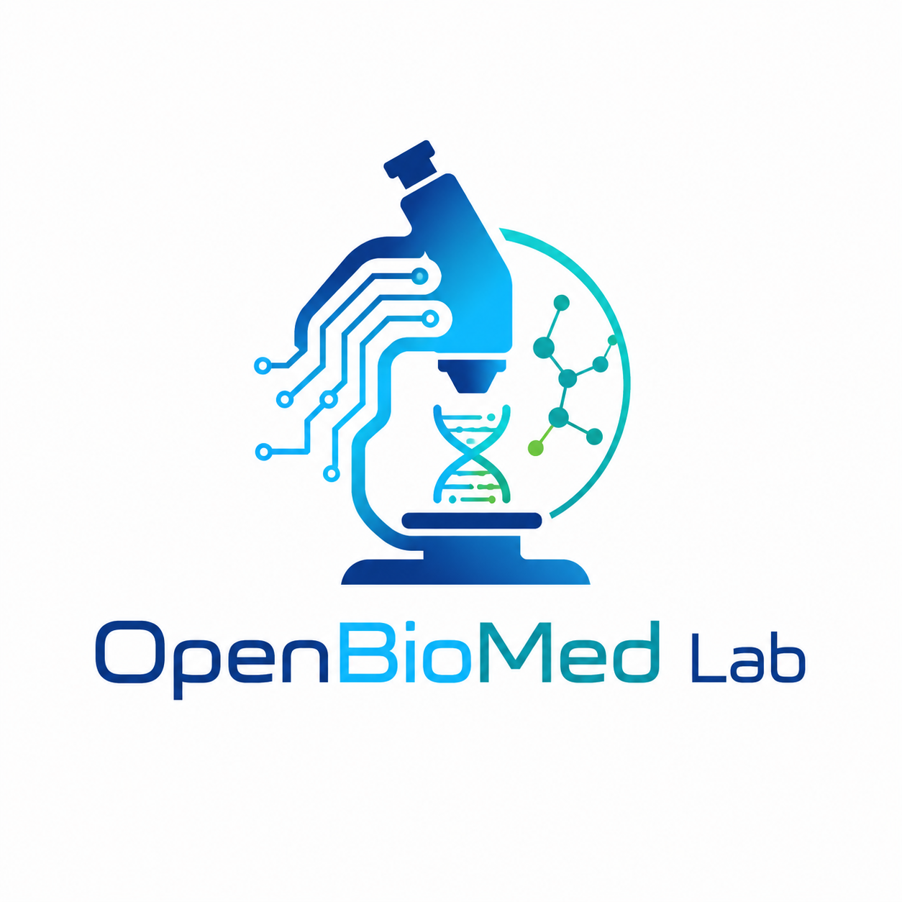

<p align="center">
  
</p>

# OpenBioMed Lab

[](literature-learning-suite/LICENSE)

## 这是什么

OpenBioMed Lab 收集在生物医学 AI 研究中开发的可复现工具。所有工具都以 AI Agent 作为主要操作界面。
文档既供人阅读，也可由 Agent 直接执行。

## 推荐运行环境

本 Lab 的每个子项目都包含 `SKILL.md`，Agent 加载后即可掌握完整操作流程。
经过验证的运行方式：

- Agent 宿主：[Hermes Agent](https://github.com/NousResearch/hermes-agent)（[文档](https://hermes-agent.nousresearch.com/docs)）
- 语言模型：[DeepSeek V4 Pro](https://www.deepseek.com/)（[API](https://platform.deepseek.com/)）

这套组合在文献深度分析任务上跑过数百篇论文。

## 子项目

### 1. Literature Learning Suite `v1.3.0`

学术文献的深度分析与知识图谱构建工具。

[项目文档](literature-learning-suite/README.md) | [中文指南](literature-learning-suite/GUIDE_ZH.md)

工具从 PubMed/arXiv 检索论文，获取全文，按 7 层结构解剖，把结果持久化为 NDJSON 知识图谱并自动生成关联边，最后输出每日速报。

安装到 Hermes Agent：

```bash
# 在 Hermes Agent 中执行
git clone https://github.com/YuQingqiu2001/OpenBioMed-Lab.git
cp -r OpenBioMed-Lab/literature-learning-suite ~/.hermes/skills/
```

装好后 Agent 会识别 `literature-learning-suite` skill，加载 `SKILL.md` 获取完整操作流程，之后用对话就能驱动文献分析。

也可以手动运行：

```bash
cd literature-learning-suite
pip install -r scripts/requirements.txt
python scripts/init_workspace.py
```

包含的内容：

| 组件 | 说明 |
|------|------|
| 检索工具 | PubMed/arXiv/bioRxiv/Crossref 多源检索 |
| 分析协议 | S 级 7 层解剖（T1-T7，含空壳检测） |
| 关联引擎 | 5 策略语义边生成（90,125 基因 + 25,939 通路） |
| 期刊数据 | 21,800 种期刊 JCR 2024 IF（自动标注） |
| 质量自检 | 10 维度知识图谱健康检查 |
| 文档 | 7 种语言（中/英/德/日/韩/西/阿） |
| MCP 模板 | PubMed/arXiv/Fetch/Playwright 四种 MCP 配置 |

实操验证数据见子项目的 [README](literature-learning-suite/README.md)。

### 2. CoVarST

[项目说明](CoVarST/README.md) | [中文指南](CoVarST/GUIDE_ZH.md) | [快速开始](CoVarST/docs/QUICKSTART.md) | [本地发布状态](CoVarST/docs/RELEASE_STATUS.md) | [核查报告](CoVarST/docs/LOCAL_AUDIT.md)

这个子项目研究从 H&E 图像恢复空间转录组表达，分三部分。第一部分把逐切片的局部 Programs 整理成每个癌种统一的固定参考矩阵；第二部分为九个癌种各整合出一个模型，从 H&E 直接推理 spot 表达；第三部分只用同切片实测的粗分辨率 ST 和真实图像里的细胞核，重建细胞级表达。

H&E 推理输出的是表达概率，细胞模块要的是实测粗计数，两者目前不能直接互换。

模型整合保留原网络容量，用同癌种多折预测概率做集成蒸馏，每个癌种最终只留一个部署模型。原始患者级交叉验证统计和整合模型的教师一致性结果分别记录，九个癌种都通过了整合一致性门槛，具体资产见项目发布清单。ParamNet、Virchow2 和 CellViT++ 只链接官方项目，不复制其权重。

### 3. CRC Survival Models

`Fig3` 使用的两套结直肠癌病理生存模型已经整理为独立子项目：

- Cell Topology：根据带细胞类型的邻接图，分别计算全组织和肿瘤前沿风险。
- Patch Feature：结合 Patch 表征、局部空间梯度和肿瘤核心、前沿、瘤周信息，以五折集成输出风险。

仓库包含模型权重、推理代码、模型卡和 `Fig3` 统计量。UNI 与 CellViT++ 只链接官方项目，不在本仓库中复制源码或权重。

[项目说明](crc-survival-models/README.md) | [快速开始](crc-survival-models/docs/QUICKSTART.md) | [Fig3 统计与模型对应关系](crc-survival-models/docs/FIG3_PROVENANCE.md)

## 路线图

| # | 子项目 | 说明 |
|---|--------|------|
| 4 | 常规生物学/医学数据运行 | 常见生物医学数据格式的读取、处理、可视化流水线 |
| 5 | CoVarST 独立验证与扩展 | 对整合部署模型开展独立验证并扩展癌种 |

## 署名

OpenBioMed Lab

| 姓名 | 机构 |
|------|------|
| Jinghua Gu | 安徽医科大学 · [2040519464@qq.com](mailto:2040519464@qq.com) · [ORCID: 0009-0000-8691-1312](https://orcid.org/0009-0000-8691-1312) |
| Shuyan Sheng | 安徽医科大学 |
| Huake Cao | 安徽医科大学 |
| Conghan Li | 安徽医科大学 |
| Taiyu Shi | 安徽医科大学 |

## 许可证

本仓库采用 **CC BY-NC-SA 4.0**（署名-非商业使用-相同方式共享）。

- 学术研究、个人学习：自由使用
- 商业用途：禁止
- 二次创作的产品：必须以相同许可证开源
